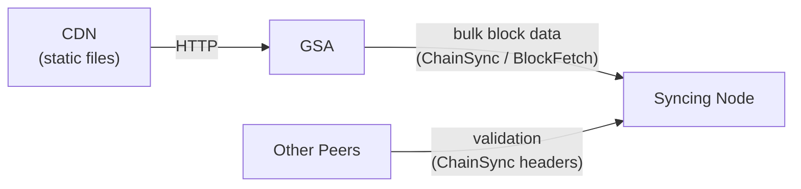

# Genesis Sync Accelerator Design

This document explains the main design decisions around the Genesis Sync Accelerator (GSA).

## The Problem

Syncing a new Cardano node can be a significant pain point for Cardano operators. It is a
lengthy operation that can consume hours or even days of resources off network nodes.
Serving Genesis-syncing peers is expensive I/O and bandwidth work that competes with a
relay's primary job: tip-following and block diffusion.

## The Approach

The goal of this project is to take most of that initial load off the Cardano network by serving bulk
historical content off a Content-Delivery Network (CDN) through a shallow node (the GSA) speaking
standard Cardano mini protocols.

The syncing node needs no modifications: it sees the GSA as a normal peer providing
ChainSync and BlockFetch.

## Why a CDN?

- CDN infrastructure has geographical distribution / replication. It can be shared among
  various network pools across the globe and guarantee that data is always served from a local relay.
- CDN infrastructure can be scaled independently of the Cardano network.
- A standard relay serves this data while concurrently running consensus, validating transactions, etc.
  The GSA is single-purpose and typically serves a single node.

## Trust and Security

The GSA itself does no cryptographic validation. The syncing node validates every block
through standard Ouroboros Genesis consensus, exactly as it would from any peer.

- Genesis protects against a compromised data source: as long as adversarial stake is
  under 50%, the node will not accept an untrue chain.
- If the data served by the GSA is bad, the sync will stall. It will not corrupt the node
  or lead it onto a wrong chain.

## Comparison with Mithril

Mithril is a related effort worth comparing against. Mithril uses certificate-based snapshots
to bootstrap a node from a known ledger state. It has different tradeoffs: it skips per-block
validation (relying instead on aggregate signatures from stake pool operators), and it
requires a dedicated client to restore a certified snapshot. The GSA validates every block
through standard consensus and is transparent to the syncing node.

## Design Properties

The GSA is:

- **Lightweight**: small bounded disk cache, little CPU.
- **Disposable**: no persistent state; tear it down and spin up a new one at will.
- **Transparent**: speaks standard Cardano mini-protocols. It is dedicated to serving the
  syncing peer through ChainSync / BlockFetch.
- **Read-only**: the GSA only serves historical chain data. It does not handle transaction
  submission or participate in consensus.

## Performance Constraints

The accelerator must be fast enough to be chosen by the Devoted BlockFetch logic of the syncing
node. That logic allows blocks to be downloaded from honest peers faster than they are validated,
which can significantly speed up initial sync. If the GSA is too slow, the node may request blocks
from another (real) node, thus defeating the purpose of the accelerator.

It may happen e.g. if the connection between the GSA and the CDN is too slow. Indeed:

- The accelerator does not store the chain locally ;
- It does not (yet) implement any prefetching logic.

### Caching

The GSA currently features a bounded cache with LRU eviction policy in order to speed up
fetching logic.

The value of this cache is probably limited: in a single-peer deployment, blocks are streamed
sequentially and never re-read. In a multi-peer deployment, peers at different
positions in the chain are likely to thrash any practical cache size.

### Prefetching

Currently, chunks are only downloaded from the CDN when they are actually needed ; this creates
significant delays at chunk boundaries, and might trigger a node to disconnect from the accelerator
and fetch blocks from another peer.

Prefetching is expected to be necessary for proper operation at scale and planned to be implemented.

## Deployment

The current deployment assumption is local: the GSA runs close to the syncing node
(same machine or LAN) as a trusted peer. The wider deployment model is TBD.
